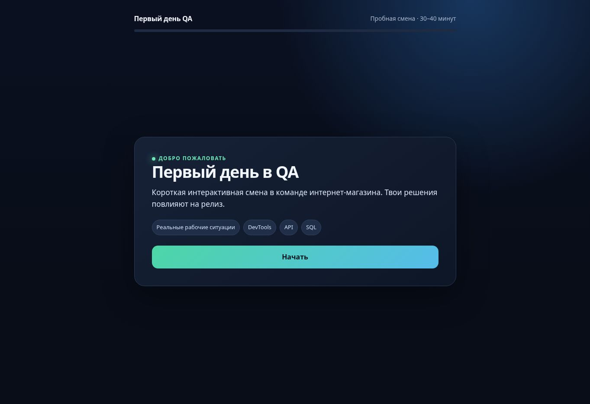
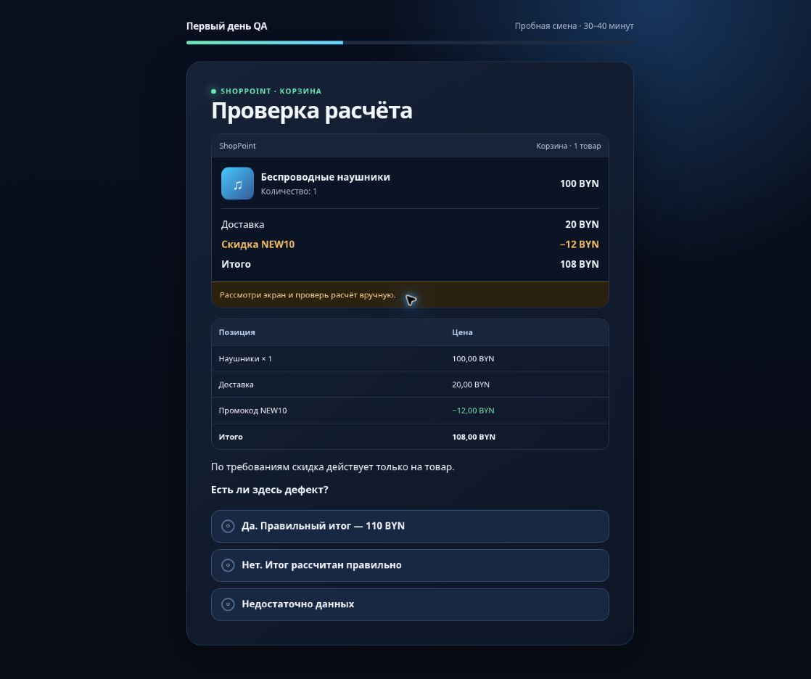
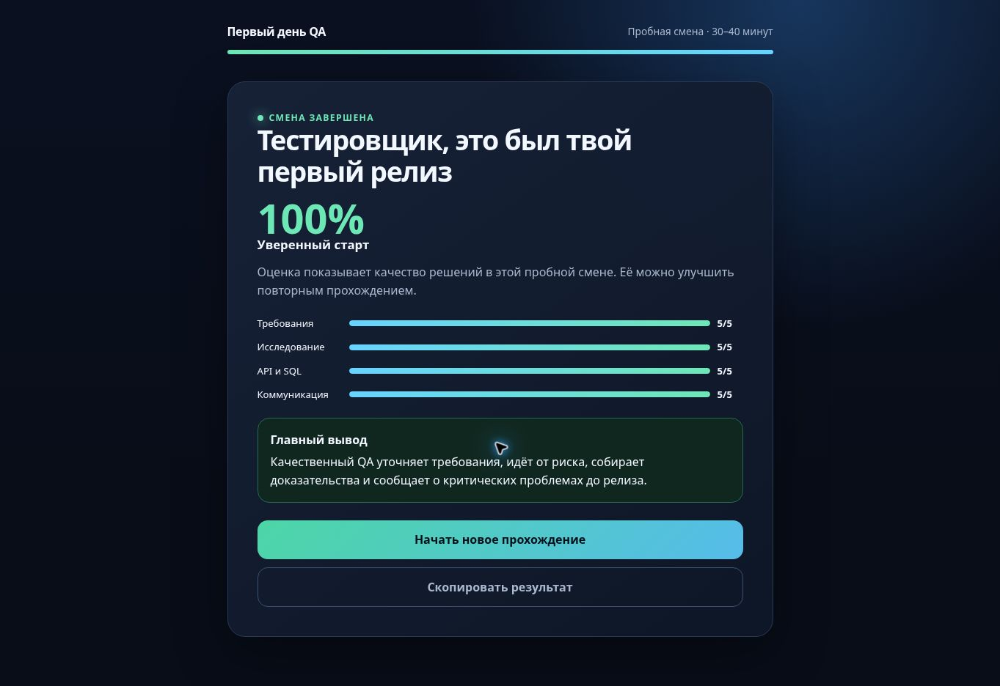

# Первый день QA

Интерактивный учебный симулятор первого рабочего дня Manual QA. Пользователь проходит карточный сценарий, анализирует требования, исследует дефекты, работает с учебными DevTools, API и SQL, оформляет баг-репорт и принимает решение о релизе.

[**▶ Попробовать онлайн**](https://pervyi-den-qa.staverviktor17.chatgpt.site)

## Как выглядит симулятор

| Старт | Учебное задание | Результат |
|---|---|---|
|  |  |  |

Прохождение занимает около 30–40 минут. Решения пользователя влияют на итоговую оценку по требованиям, исследованию, API и SQL, а также коммуникации.

## Публичная версия

https://pervyi-den-qa.staverviktor17.chatgpt.site

## Возможности текущего прототипа

- персональное обращение по имени;
- сохранение прогресса на устройстве;
- ветвящиеся решения и последствия;
- учебные задания по DevTools, API и SQL;
- упрощённая Jira и баг-репорт;
- итоговая оценка;
- адаптация под телефон;
- работа без регистрации и серверной части.

На стартовом экране можно начать смену в новом рабочем столе QA. Этот маршрут проходит задачу SP-214, уточнение требований, чек-лист, настройку промокода и расчёт корзины, затем передаёт имя, решения и баллы в основной сценарий на этапе DevTools. Остальные части Дня 1 пока остаются в карточном формате. Справочник, корзина, API и база данных — учебные данные, без подключения к реальным сервисам.

## Локальный запуск

Откройте `dist/index.html` в браузере. Для проверки через локальный сервер:

```bash
python3 -m http.server 8000 --directory dist
```

## Проверки

```bash
npm install
npx playwright install chromium
npm test
```

`npm test` запускает структурный smoke-тест и полный E2E-сценарий в Chromium. Те же проверки автоматически выполняются в GitHub Actions при каждом push и pull request.

Процесс разработки и обязательные контрольные точки описаны в [docs/DEVELOPMENT_PROCESS.md](docs/DEVELOPMENT_PROCESS.md).

Перед новым этапом прочитайте [банк памяти проекта](docs/PROJECT_MEMORY.md): в нём собраны принятые решения, границы проекта, обязательные проверки и следующий шаг.

Идеи и этапы развития хранятся в [дорожной карте](docs/ROADMAP.md). Текущий статус — **укрепляем День 1 и постепенно переносим его в рабочий стол**.
